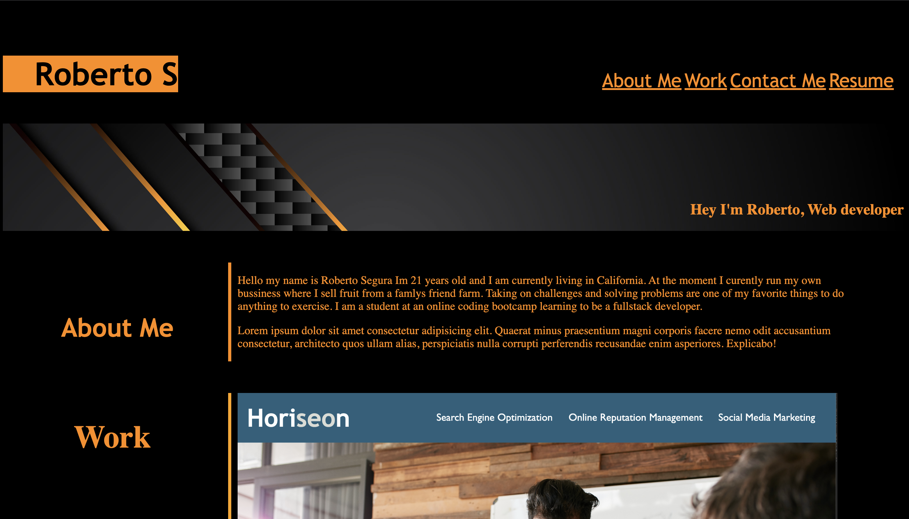

# <Potfolio>

## Description

Motivation behind this project was to structure website where I can showcase my work to future employers.I built this project so a future employer can have somewhere to see my work and get to know a little bit about me and where they can reach me . I learned many things from getting the hang of flex box to learning how to structure the website to any size. Having a portfolio is really important as employers can see what your capable of and also you  have somewhere to display your work. This was my first time creating a website from scratch and It has taught me that comsistency is key to learning code.

## Usage
deploy link to website: https://robertox17.github.io/challenge-1-horiseon/

